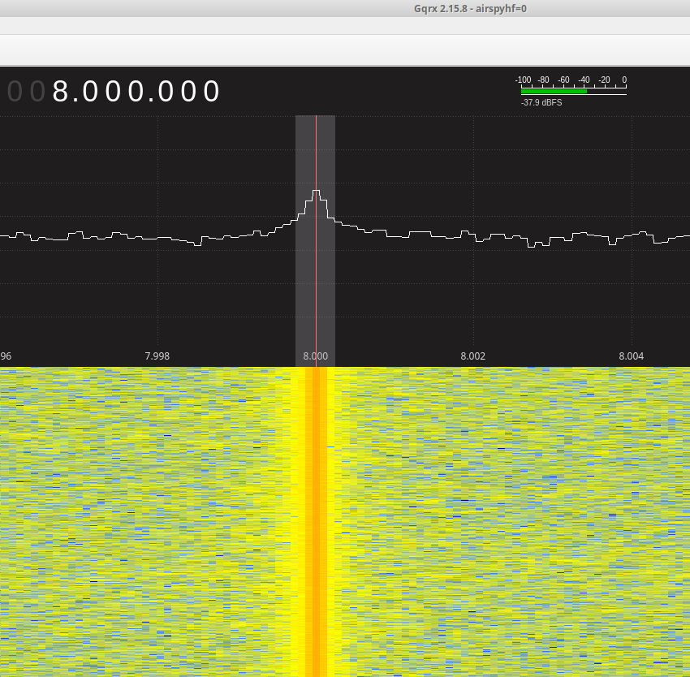

#### What

This code turns a NEO-6M GPS module (or better) into a accurate frequency
reference source.

This can be used to calibrate freqeuncy counters, SDRs, and so on.

The accuracy is minimal 2e-8 it seems - which the mind fails to comprehend ;)

#### Demo

http://pirshared.org/sdrplay/ has a video of this system in action!

#### Connections

Connect GPS' TX pin to pin 12 (GP9) of Pi Pico. Connect GPS' RX pin to pin 11
(GP8) of Pi Pico.

The code will configure the GPS module to generate a 12 MHz frequency reference.

#### Usage

Connect the PPS output pin, and GND of the GPS module to Pin 15 and GND
(respectively) of Raspberry Pi Pico for frequency measurement.

https://github.com/kholia/pico_ft8_xcvr/tree/main/PicoFrequencyCounter has
more details on this topic.

#### SDR Calibration

This GPS `frequency reference source` can be used to calibrate a SDR device as
well!

Attach a loop-of-wire (antenna) to the SDR, and keep it very very near to the
PPS pin of the GPS module.

The Gqrx software provides native support to change the `ppm` value on the fly.

I strongly recommend using the `Airspy HF+ Discovery SDR` for lab work.

#### Build

This project uses https://github.com/earlephilhower/arduino-pico core. Install
this `core` into your Arduino IDE, and then Compile this project using `Arduino
IDE`.

#### Credits

This project is based on https://github.com/MxFxM/uBlox7_TimePulse work.

- https://www.qsl.net/pa2ohh/17gps.htm

- http://www.ra3apw.ru/proekty/ublox-neo-7m/

- https://sites.google.com/site/g4zfqradio/u-blox_neo-6-7

#### Notes

Note: Keep frequency in the form of `48 / N`. Keep it at 12 MHz or 8 MHz for
minimum jitter.
